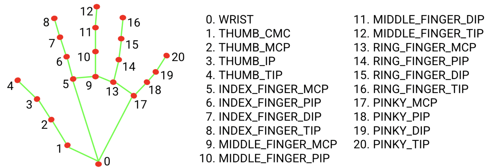

# YOLOPipe — Docker image for YOLO + MediaPipe (ROS2)

A lightweight container image that builds and runs the ROS2 workspace included in this repository. The workspace bundles a YOLO-based ROS2 integration and a MediaPipe-based ROS node for ease integration visual neural network in different domain.

## Repositories referenced

- YOLO (example/related project): https://github.com/mgonzs13/yolo_ros.git
- MediaPipe (official): https://github.com/google/mediapipe

> This repository assembles code and examples that reference the projects above. Check their individual licenses and docs for usage details.
> https://mediapipe-studio.webapps.google.com/demo/hand_landmarker


## What this image contains

- A ROS2 workspace at `/yolopipe/ros2_ws` inside the container.
- The ROS2 packages from the `ros2/` folder in this repository (built with `colcon`).
- Python dependencies defined in `ros2/requirements.txt` are installed during image build.
### Hand Tracking

*Skeleton of hand tracking with numbered keypoints.*

- **MediaPipe**: Ready to use. A classifier for hand gesture is also used starting from keypoints location.
- **YOLO 11**: Need trained.  
### Other 
The container is intended to work with general pourpouse. Different YOLO models and weights can be used for object detection, segmentation, human pose estimation, etc.

## Build
From the repository root (where this `Dockerfile` lives) build the image:

```bash
docker compose build
```

This runs a two-stage build: first it installs system and Python deps and runs `rosdep install` (using only package.xml/requirements cached layers wherever possible), then it builds the full workspace with `colcon`.

## Run

Run via Docker Compose:

```bash
docker compose run --rm yolopipe
```

Look at the `compose.yaml` file and change it accordingly to perform different behaviour


## Model files, packaging and common failure

Models and weight are intended to be placed in the folder data and mounted at runtime inside the conteiner. Be aware of path usage to locate this files.  
Example: 

```
ros2 launch yolo_bringup yolo.launch.py model:=data/weights/yolov8m-pose.pt
```
It will look for weights (used in *pose tracking*) in the directory `data/weights/yolov8m-pose.pt` . If it cannot locates such weights, it will download and store them into `data/weights/` folder.


## License

See `LICENSE` in this repository and the licenses of the linked projects (YOLO / MediaPipe) for third-party components.

---